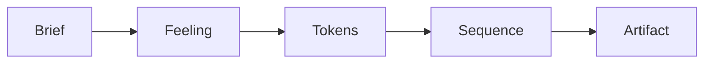

# Hedgehog Landing Page Core ⭐

### A Page That Looks Designed, Not Generated

Most AI-built landing pages look the same: a hero, three feature cards,
a pricing table, done in five minutes and forgettable in five seconds.

This core builds a page with an actual point of view — a brief, a
feeling, and a visual system decided before a single section gets
written, then carried through every section that follows.



## What you get

- **Astro + Tailwind v4**, fast by default, nothing to configure.
- **A real animation and motion layer** (Motion, Lenis, SplitType, ogl)
  instead of a static page pretending to be a product.
- **A copywriting skill built in** — headlines and section copy written
  for the page, not generic marketing filler.
- **A Polish Loop**: a visual reviewer and a UX reviewer check the built
  page before you ever see it.

## Built for real launches

Reach for this core for a marketing page, an announcement, a waitlist,
or a portfolio — any page with no persistent data of its own. A dozen
sections is still a landing page; it only becomes a different core once
there's a real backend behind it.

## Easy to install and use

Ask your agent:
*"Install Hedgehog and build me a landing page for [your product]"*

<details>
<summary>For your agent</summary>

```
npx @skyf0xx/hedgehog init
```

Hedgehog's planner selects this core automatically for a marketing or
announcement page with no persistent data of its own. You can also
request it directly:

```
npx @skyf0xx/hedgehog init --landing-page
```

Technical details: [ARCHITECTURE.md](ARCHITECTURE.md)
