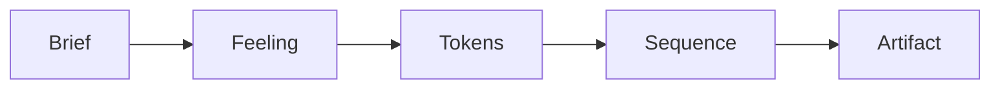

# Hedgehog Landing Page Core ⭐

### A Page With a Point of View

AI-built landing pages tend to blur together: a hero, three feature
cards, a pricing table, done in five minutes and forgettable in five
seconds.

This core starts with a brief, a feeling, and a visual system, fixed
before a single section gets written, then carries that system through
every section that follows.



## What you get

- **Astro + Tailwind v4**, fast by default, nothing to configure.
- **A working animation and motion layer** (Motion, Lenis, SplitType,
  ogl), built so the page moves like a shipped product.
- **A copywriting skill built in**, writing headlines and section copy
  for the page instead of generic marketing filler.
- **A Polish Loop**: a visual reviewer and a UX reviewer check the built
  page before you ever see it.

## Built for launches

Reach for this core for a marketing page, an announcement, a waitlist,
or a portfolio: any page with no persistent data of its own. A dozen
sections is still a landing page. Add a backend behind it, and the
project needs a different core.

## Easy to install and use

Ask your agent:
*"Install Hedgehog and build me a landing page for [your product]"*

<details>
<summary>For your agent</summary>

```
npx @skyf0xx/hedgehog init
```

Hedgehog's planner selects this core automatically for a marketing or
announcement page with no persistent data of its own. You can also
request it directly:

```
npx @skyf0xx/hedgehog init --landing-page
```

Technical details: [ARCHITECTURE.md](ARCHITECTURE.md)
